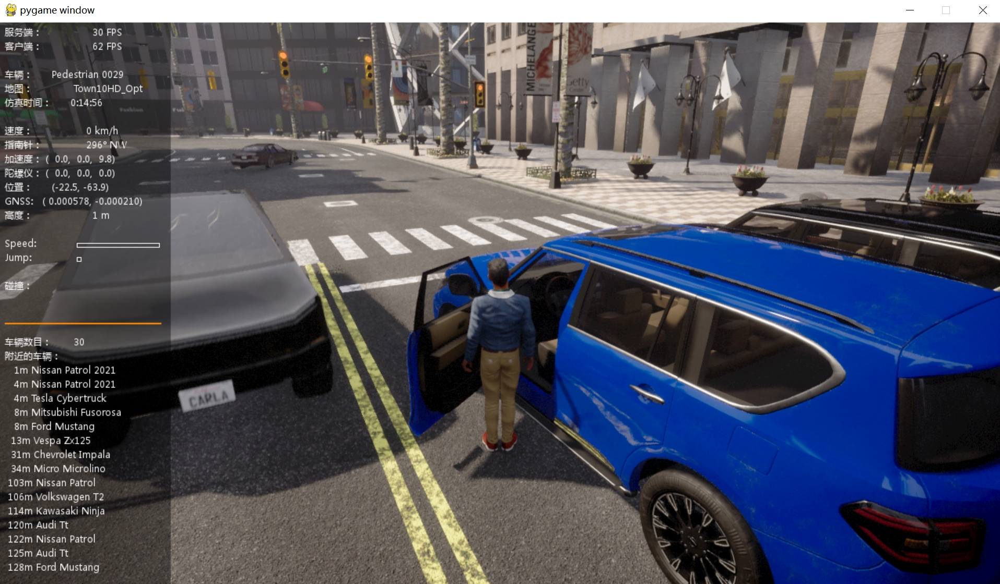

# 驾驶游戏

## 部署
从 [链接](https://pan.baidu.com/s/1QNG1RGGb3jzv8N0d7vIFiw?pwd=hutb) 中下载 `WindowsNoEditor_9.15.zip` ，解压到当前工程目录下；然后双击执行`launch.vbs`。

默认启动的是车辆手动控制，通过以下命令启动手动控制行人：
```shell
python manual_control.py --filter walker.pedestrian.*
```
使用方向键进行移动，空格进行跳跃。按`o`打开车门。
效果图：



## 操作

在行人默认跑步，同时按`Shift`键表示行走（速度 1 m/s）。

一直按着空格会一直朝天上跳跃上升。

## 参考

* [中文文档](https://openhutb.github.io/carla_doc/)
* [Pygame构建游戏](https://www.cnblogs.com/apachecn/p/18140528) 
* [侠盗猎车5](https://github.com/OpenHUTB/gta5) 

